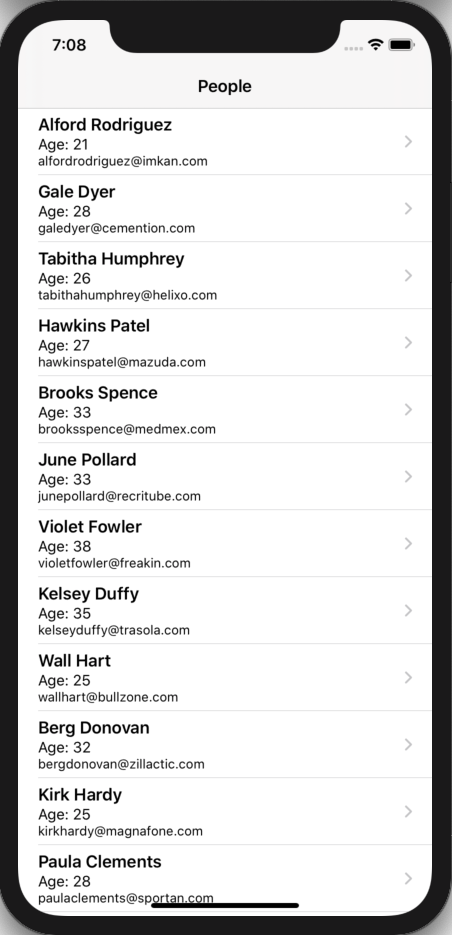
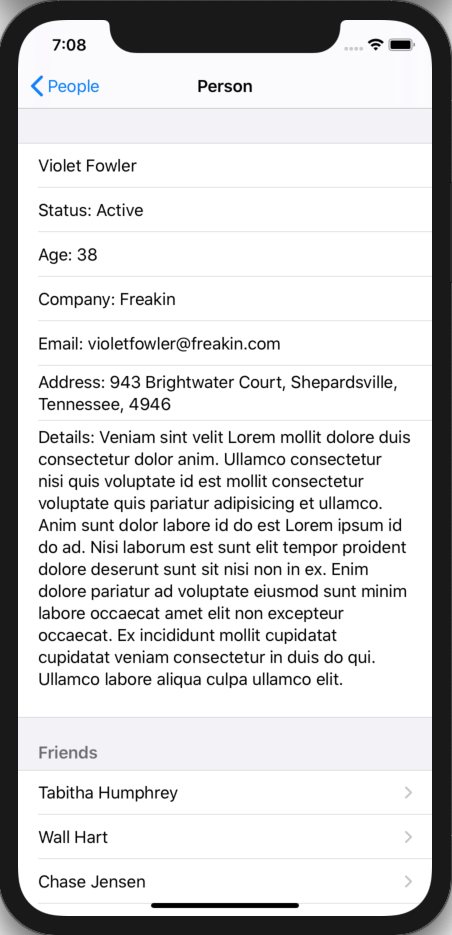
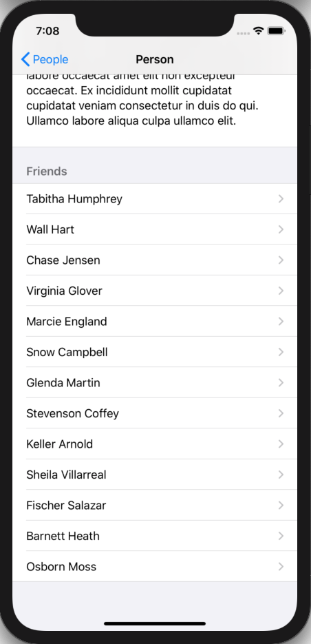
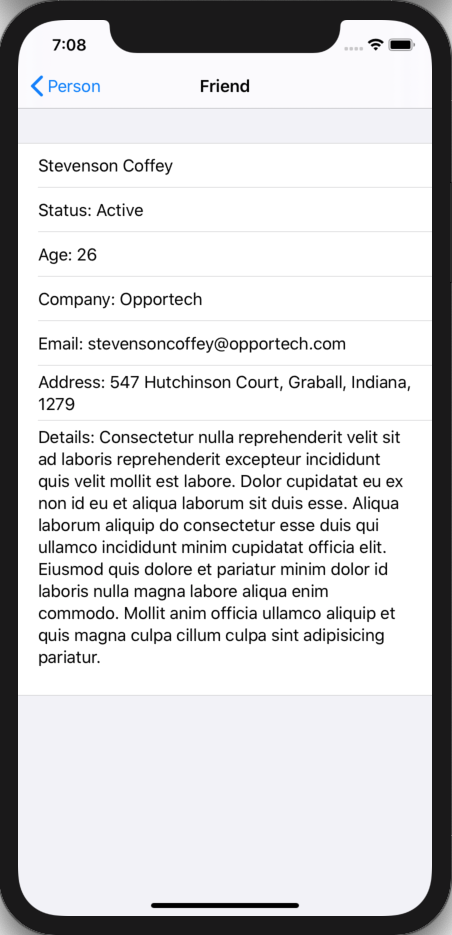

# 100 Days of SwiftUI Project 13

## Friends

**App Description:**  App that downloads JSON from the internet, converts it to Swift Types and displays this to the User.

**Swift Features Used:**
URLSession, Codable, NavigationView, List, @Published, View Composition.

**Screenshots:**

